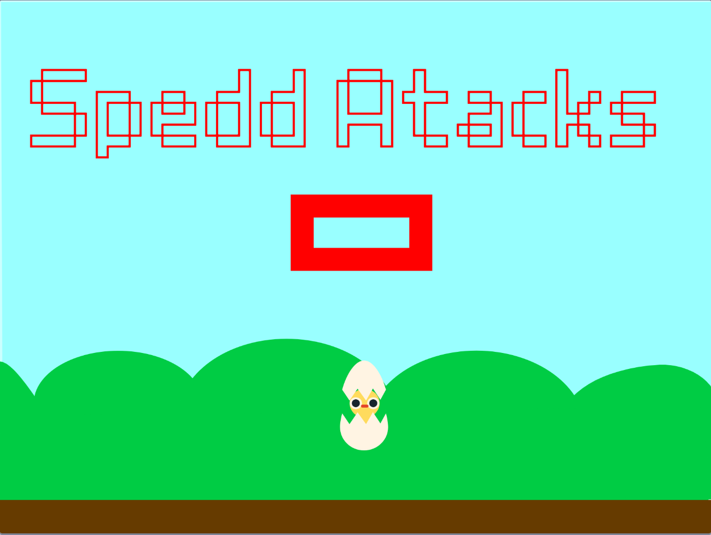

# Speed Atacks - Rubik Timer
*Just for fun my undone scratch project*

## About
Created on 18 ‎April, ‎2020

This is my Rubik's Clock project when I was a kid. There are many logic errors and many flaws but I leave it there to review my old self :] .

How to use: Geen flag first. Hold the up arrow key then release and solve the rubik. Stop the clock with the space bar.

